# CI/CD Pipeline Optimizer with AI Analysis

Plateforme d’optimisation intelligente des pipelines CI/CD. Le système collecte les données Jenkins, les analyse avec des LLM guidés par une base de connaissances DevOps, et fournit des recommandations actionnables ainsi qu’un script Groovy optimisé. L’objectif principal est de démocratiser la connaissance DevOps en rendant l’optimisation accessible, guidée et reproductible pour toutes les équipes.

## Table des matières

- [Vision et objectifs](#vision-et-objectifs)
- [Contexte et problématique](#contexte-et-problematique)
- [Approche proposée](#approche-proposee)
- [Fonctionnalités principales](#fonctionnalites-principales)
- [Acteurs et cas d’usage](#acteurs-et-cas-dusage)
- [Contraintes et choix techniques](#contraintes-et-choix-techniques)
- [Architecture générale](#architecture-generale)
- [Microservices et responsabilités](#microservices-et-responsabilites)
- [Module AI Analyzer](#module-ai-analyzer)
- [Modèle de données](#modele-de-donnees)
- [Conception des interactions](#conception-des-interactions)
- [Sécurité et performance](#securite-et-performance)
- [Interface utilisateur](#interface-utilisateur)
- [API et collection Bruno](#api-et-collection-bruno)
- [Tests et validation](#tests-et-validation)
- [Démarrage du projet](#demarrage-du-projet)
- [Configuration](#configuration)
- [Structure du dépôt](#structure-du-depot)
- [Conclusion](#conclusion)

## Vision et objectifs

L’objectif est d’optimiser automatiquement les pipelines CI/CD Jenkins en combinant :

- Collecte exhaustive de données Jenkins (statistiques, configuration, logs, historique, agents, serveur)
- Base de connaissances DevOps structurée pour guider l’analyse IA
- Recommandations personnalisées et script Groovy optimisé
- Interface web pour la gestion des connexions, l’analyse et l’historique

Objectifs principaux :

- Automatiser l’analyse de performance des pipelines
- Fournir des recommandations applicables et contextualisées
- Réduire les temps d’exécution et optimiser les ressources
- Améliorer la fiabilité des déploiements
- Démocratiser l’expertise DevOps

## Contexte et problématique

Les pipelines CI/CD modernes sont devenus complexes, longs et difficiles à diagnostiquer. Les équipes rencontrent :

- Complexité croissante et pipelines interdépendants
- Manque de visibilité sur les goulots d’étranglement
- Expertise dispersée ou indisponible
- Analyse réactive (problèmes détectés après impact)

Le projet répond à ces limites par une analyse IA guidée et une base de connaissances structurée.

### État de l’art (synthétique)

- Outils de monitoring (Prometheus/Grafana) : visualisations utiles mais peu d’analyse contextuelle pipeline
- Solutions commerciales (Datadog, New Relic, Splunk) : dashboards puissants mais analyse CI/CD limitée
- Écosystème Jenkins (plugins) : visualisation sans recommandations d’optimisation
- Plateformes d’optimisation (Harness, GitLab Insights, CircleCI) : analyse partielle ou limitée à leur écosystème

### Positionnement et innovation

- Analyse guidée par base de connaissances DevOps
- Collecte multi-dimensionnelle des données Jenkins
- Recommandations actionnables (scripts Groovy optimisés)
- Support multi-provider IA (OpenAI, Gemini, Groq)

## Approche proposée

1. Collecte automatisée des données Jenkins via un connecteur REST.
2. Construction d’un prompt guidé par base de connaissances (best practices DevOps).
3. Analyse par LLM (OpenAI, Gemini, Groq) et génération de recommandations.
4. Restitution via une interface web avec historique et comparaison.

Détails du workflow d’optimisation :

- Récupérer la connexion Jenkins (isolation par utilisateur)
- Collecter les 6 jeux de données Jenkins (stats, config, logs, historique, agents, serveur)
- Construire le prompt (Mission + Knowledge Base + Instructions + format JSON)
- Exécuter l’analyse LLM
- Parser la réponse et produire une `OptimizationResponse`
- Sauvegarder l’historique (scripts + analyses + gains)

## Fonctionnalités principales

- Authentification JWT avec gestion de session via Redis
- CRUD complet des connexions Jenkins + tests de connectivité
- Récupération pipelines/builds/logs/configurations
- Optimisation IA (bottlenecks, recommandations, script Groovy optimisé)
- Historique et filtrage des optimisations
- API Gateway centralisant la sécurité et le routage
- Support complet Jenkins : pipelines, builds, logs, config, statistiques, agents, serveur

## Acteurs et cas d’usage

Acteurs :

- Utilisateur (Dev/DevOps)
- Serveur Jenkins
- Services IA (LLM)

Modules de cas d’usage :

- Authentification (inscription, connexion, déconnexion)
- Gestion des connexions Jenkins (création, test, activation, suppression)
- Consultation Jenkins (pipelines, builds, logs, configuration)
- Optimisation IA + consultation de l’historique

Diagramme de cas d’usage :

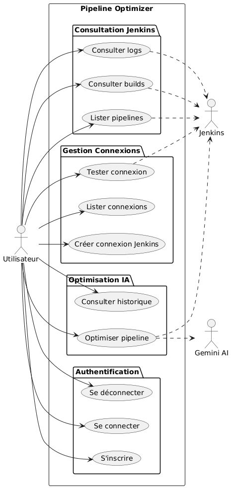

Diagramme de séquence système (optimisation pipeline) :

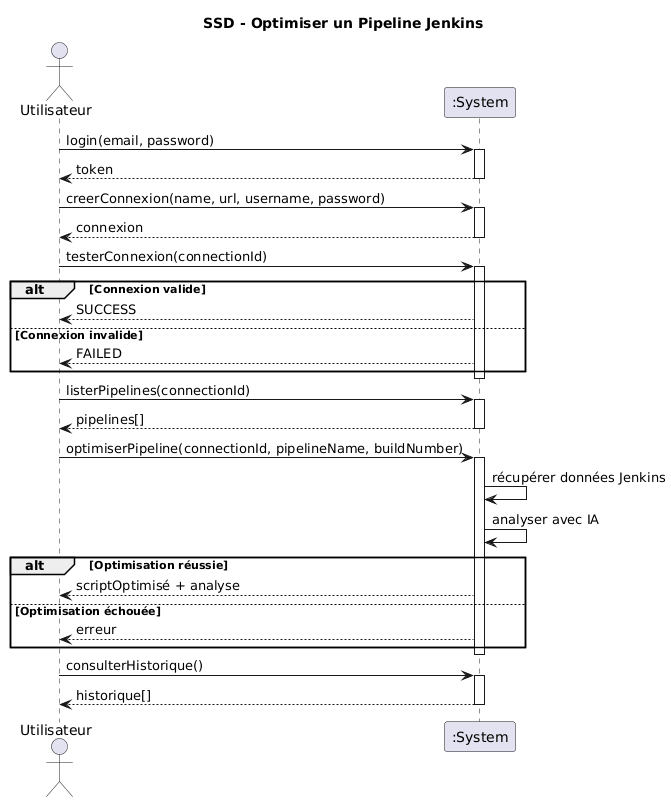

## Contraintes et choix techniques

- Architecture microservices Spring Boot
- PostgreSQL pour la persistance
- Redis pour cache/session JWT
- Interface web moderne et responsive (Next.js)
- Intégration Jenkins via API REST standard
- Support multi-provider IA (OpenAI, Gemini, Groq)

## Architecture générale

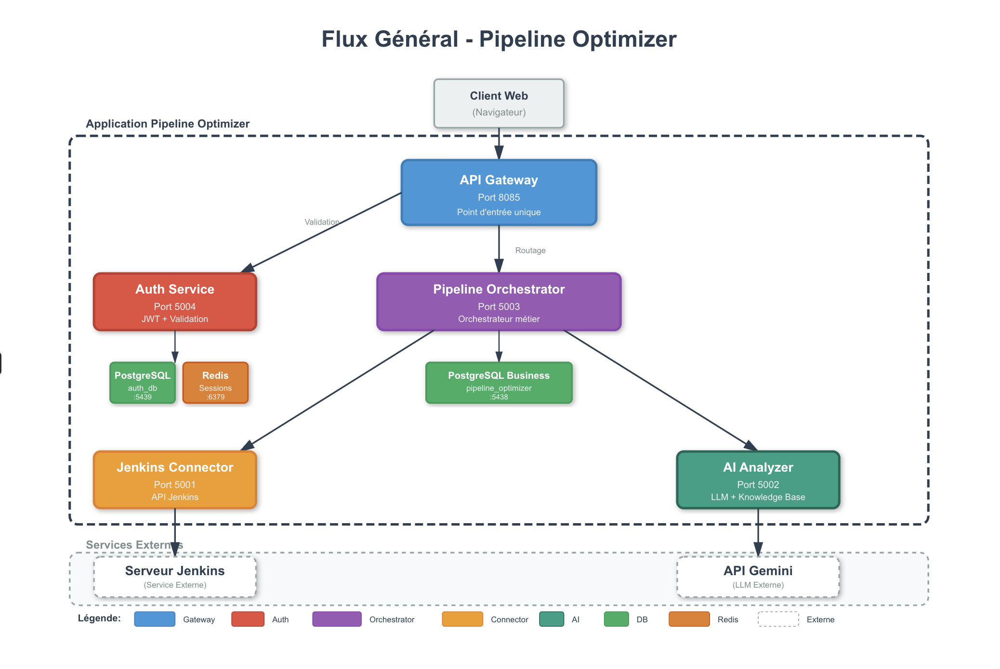

L’architecture microservices se compose de six services, orchestrés par l’API Gateway :

- Client Web (Next.js)
- API Gateway (port 8085)
- Auth Service (port 5004)
- Pipeline Orchestrator (port 5003)
- Jenkins Connector (port 5001)
- AI Analyzer (port 5002)

Technologies :

- Frontend : Next.js, TypeScript, Tailwind CSS
- Backend : Spring Boot 3.x, Java 17, Spring Security, Spring Data JPA
- Infra : PostgreSQL, Redis, Docker, Docker Compose
- Intégrations : Jenkins REST API, LLM (OpenAI/Gemini/Groq), Bruno

## Microservices et responsabilités

### API Gateway

- Point d’entrée unique et routage
- Filtre d’authentification
- Injection du header `X-User-Email` pour les microservices protégés

Configuration dans [backend/api-gateway/src/main/resources/application.yml](backend/api-gateway/src/main/resources/application.yml).

### Auth Service

- Gestion des comptes utilisateurs et JWT
- Cache des sessions via Redis
- Émission des tokens + CSRF
- Validation des tokens pour l’API Gateway

Configuration dans [backend/auth-service/src/main/resources/application.properties](backend/auth-service/src/main/resources/application.properties).

### Pipeline Orchestrator

- Service métier central
- Gestion des connexions Jenkins
- Orchestration des optimisations et historique
- Orchestration des appels vers Jenkins Connector et AI Analyzer

Configuration dans [backend/pipeline-orchestrator/src/main/resources/application.properties](backend/pipeline-orchestrator/src/main/resources/application.properties).

### Jenkins Connector

- Intégration Jenkins REST API
- Collecte des données (pipelines/builds/logs/config)
- Normalisation des réponses JSON

Configuration dans [backend/jenkins-connector/src/main/resources/application.properties](backend/jenkins-connector/src/main/resources/application.properties).

### AI Analyzer

- Pipeline de traitement IA
- Base de connaissances DevOps
- Parsing des réponses LLM
- Génération de script Groovy optimisé et recommandations priorisées

Configuration dans [backend/ai-analyzer-service/src/main/resources/application.properties](backend/ai-analyzer-service/src/main/resources/application.properties).

## Module AI Analyzer

Pipeline IA (3 phases) :

1. **Entrée** : six types de données Jenkins (buildStatistics, pipelineConfig, buildLog, buildHistory, agentInfo, serverInfo)
2. **Traitement** :
   - DocumentLoaderService (nettoyage/structuration)
   - PromptBuilderService (mission + knowledge base + instructions + format JSON)
   - OptimizationService (orchestration)
   - Provider LLM (Gemini, Groq, OpenAI)
3. **Sortie** : `OptimizationResponse` (analysis, optimizations, optimizedScript, estimatedGain, provider)

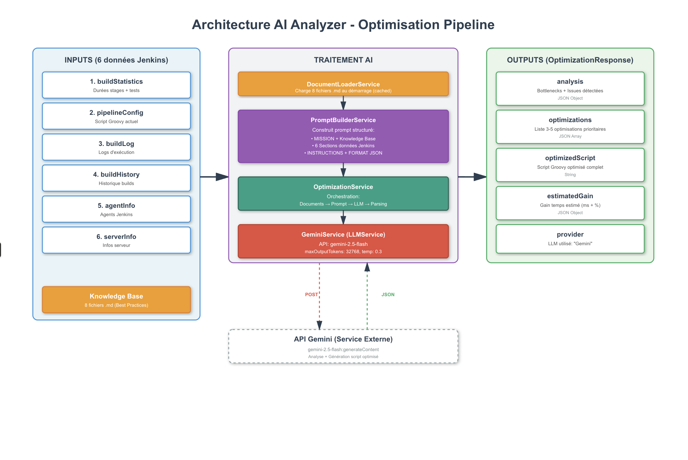

### Base de connaissances

La base de connaissances guide les LLM vers des recommandations précises et applicables. Catégories principales :

- Best practices Jenkins (parallélisation, cache, agents)
- Groovy optimization (patterns pipeline)
- Performance tuning (profiling, monitoring)
- CI/CD patterns (stratégies tests/déploiement)
- Error handling (retry, fallback)
- Security guidelines (secrets, validation)
- Resource management (CPU/mémoire/stockage)
- Monitoring & logging (metrics, alerting)

Les documents sont dans [backend/ai-analyzer-service/src/main/resources/knowledge-base](backend/ai-analyzer-service/src/main/resources/knowledge-base).

### Données Jenkins collectées (détails)

- **buildStatistics** : durées des stages, temps total, timing des étapes
- **pipelineConfig** : script Groovy du pipeline
- **buildLog** : logs textuels d’exécution
- **buildHistory** : historique des builds (numéro, durée, statut)
- **agentInfo** : agents Jenkins et capacités
- **serverInfo** : version, informations serveur et état

## Modèle de données

Entités principales :

- User
- JenkinsConnection
- OptimizationHistory
- Énumérations : `TestStatus` et `OptimizationStatus`

### User

- Identifié par email (unique)
- Contient `username`, `createdAt`, `updatedAt`
- Relation 1:N avec `JenkinsConnection`

### JenkinsConnection

- Propriétaire (User)
- Champs : `name`, `url`, `username`, `password`, `isActive`
- `testStatus` et `lastTestedAt` pour la connectivité
- Relation 1:N avec `OptimizationHistory`

### OptimizationHistory

- `pipelineName`, `buildNumber`, `completedAt`, `status`, `llmProvider`
- `originalScript`, `optimizedScript`
- `analysisJson`, `optimizationsJson`, `estimatedGainJson`
- `currentDurationMs`, `estimatedDurationMs`, `reductionPercentage`
- `errorMessage` si échec d’optimisation

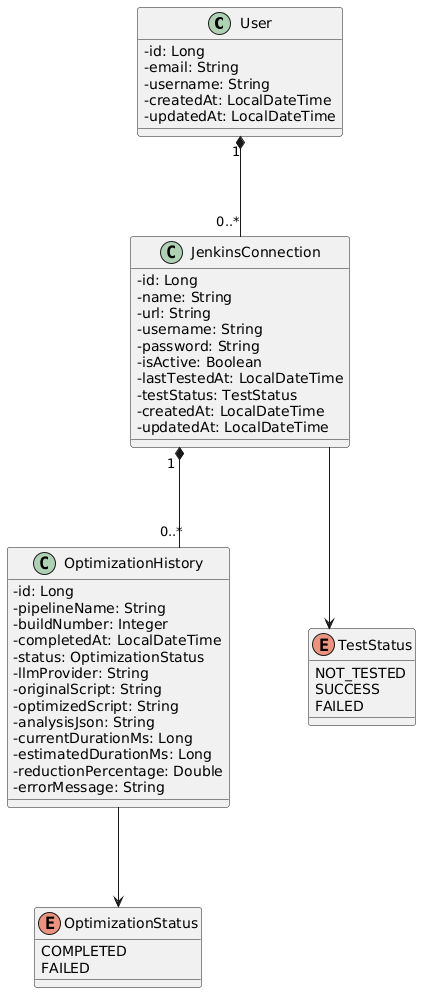

## Conception des interactions

### Authentification et sécurité

- JWT + protection CSRF
- Cache Redis pour révocation des sessions
- Injection d’entêtes sécurisés
- Cookies HttpOnly pour la session

Flux :

- `/api/auth/login` retourne `accessToken` + `csrfToken`
- Le frontend stocke les tokens et les envoie via `Authorization: Bearer` et `X-CSRF-Token`
- L’API Gateway valide le token et injecte `X-User-Email`

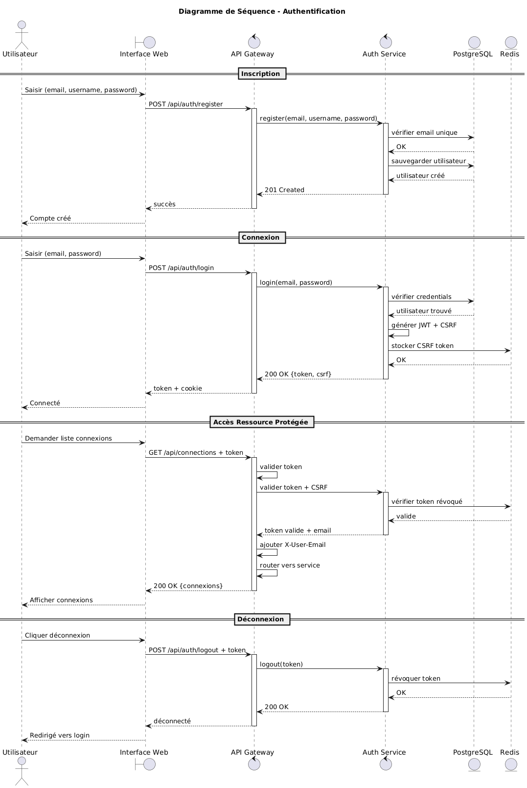

### Gestion des connexions Jenkins

- Création avec validation propriétaire et chiffrement des credentials
- Test en temps réel via API Jenkins
- Statuts `NOT_TESTED` -> `SUCCESS` ou `FAILED`
- Désactivation sans suppression via `isActive`
- Isolation stricte par utilisateur

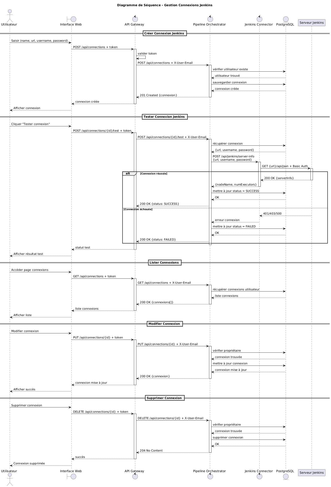

### Processus d’optimisation IA

- Collecte parallèle des données Jenkins
- Analyse IA guidée par knowledge base
- Sauvegarde complète de l’historique

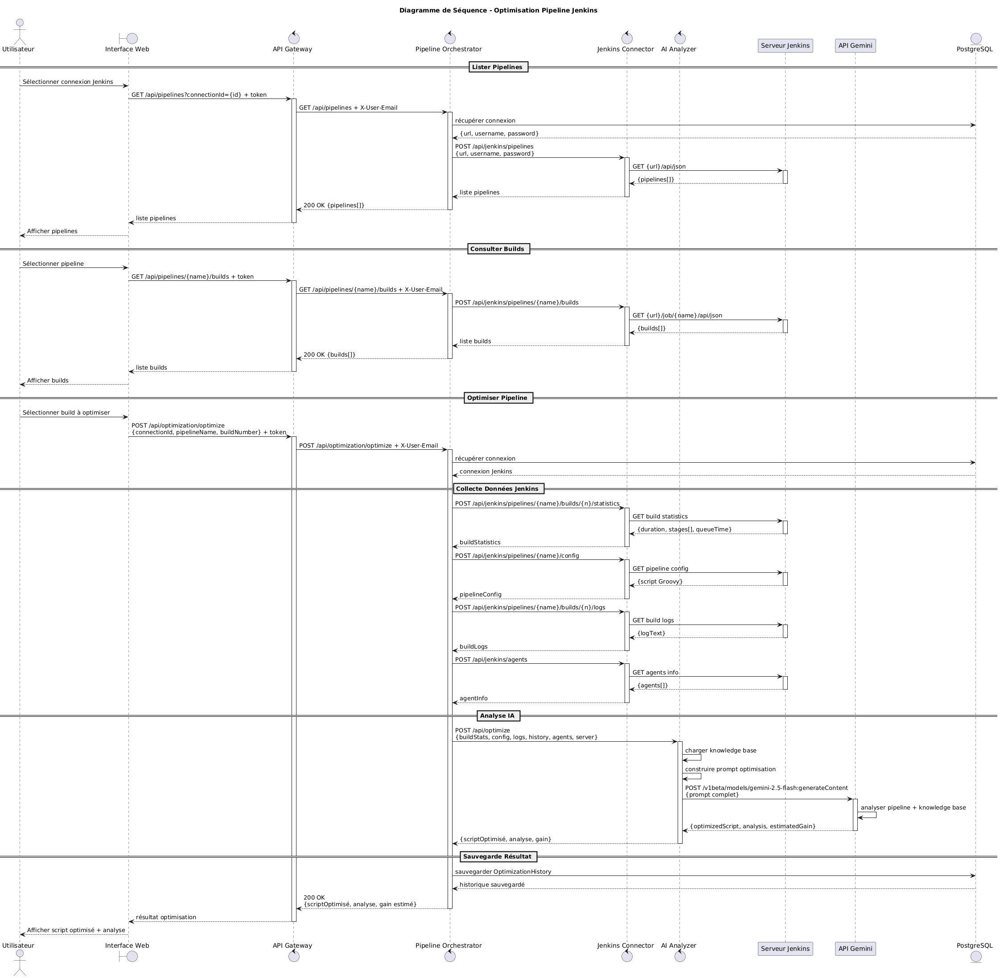

### Consultation de l’historique

- Vue globale par utilisateur
- Filtrage par connexion ou pipeline
- Détails complets par optimisation

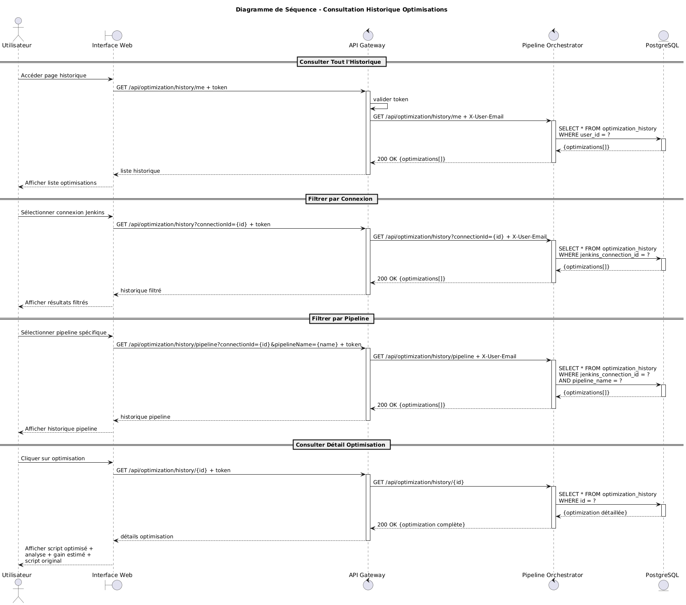

## Sécurité et performance

- Chiffrement des credentials Jenkins en base
- Isolation multi-tenant par utilisateur
- Validation d’autorisation pour chaque opération
- Cache Redis pour les sessions JWT
- Indexation PostgreSQL (user_id, connection_id, pipeline_name)

## Interface utilisateur

Le parcours utilisateur couvre l’authentification, la gestion des connexions, l’optimisation IA et l’historique :

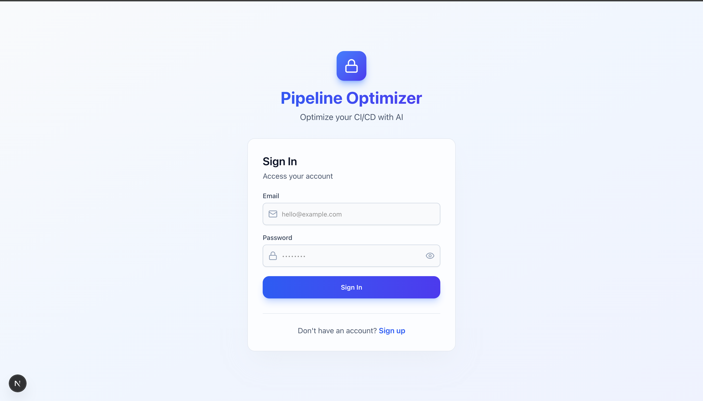
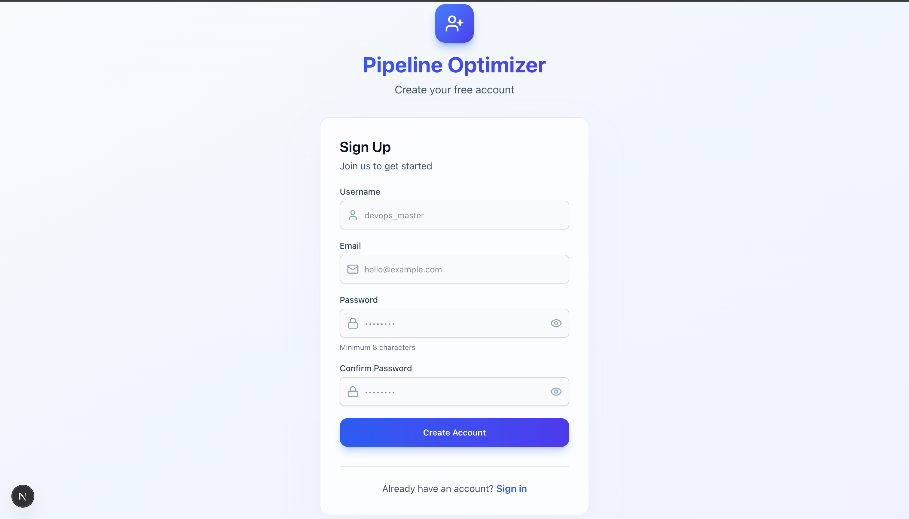
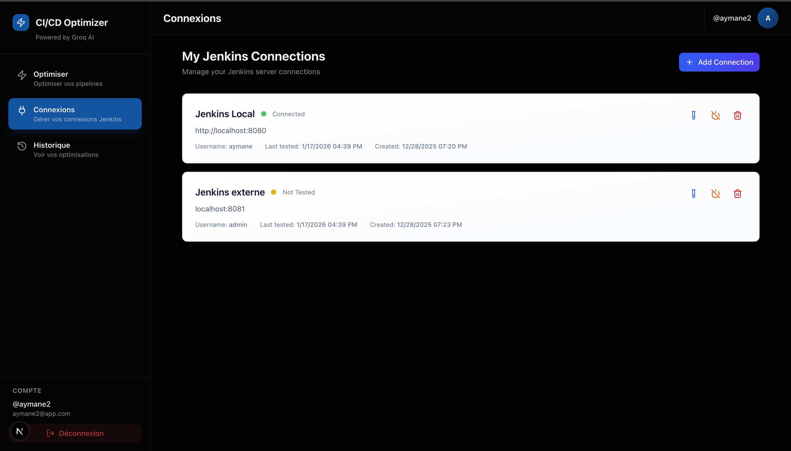
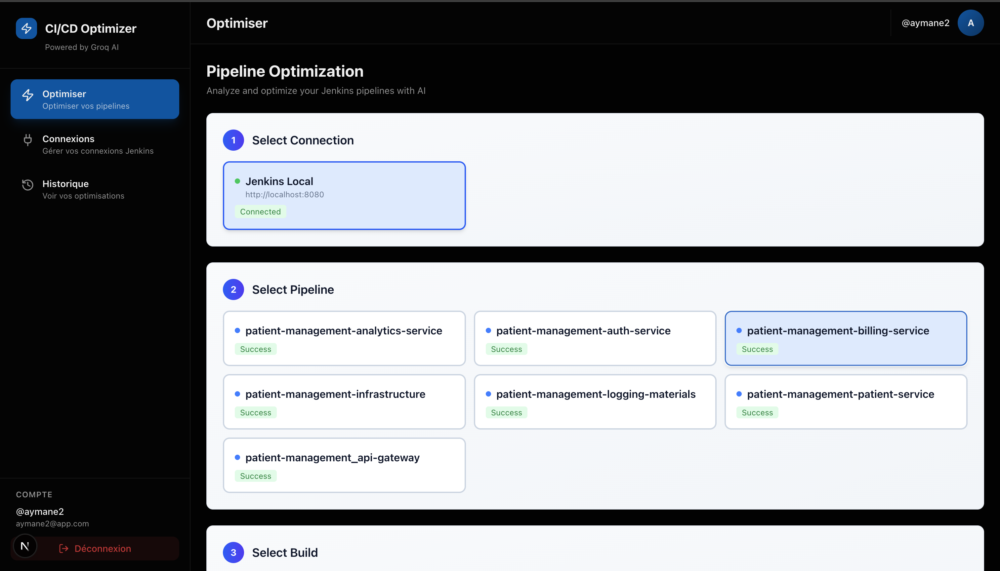
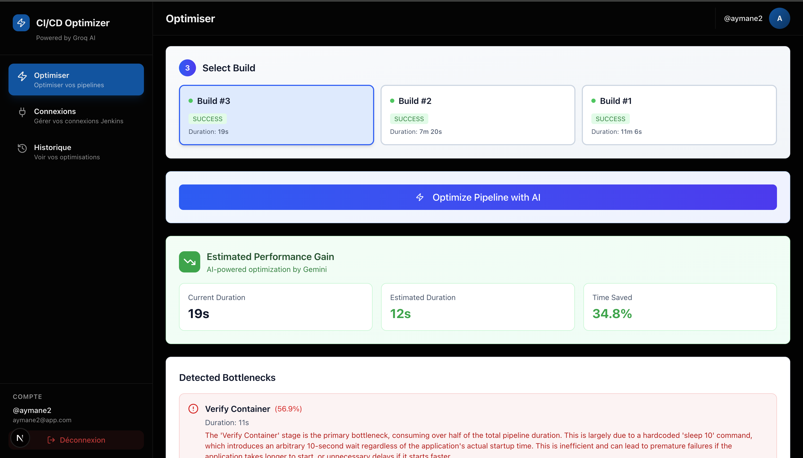
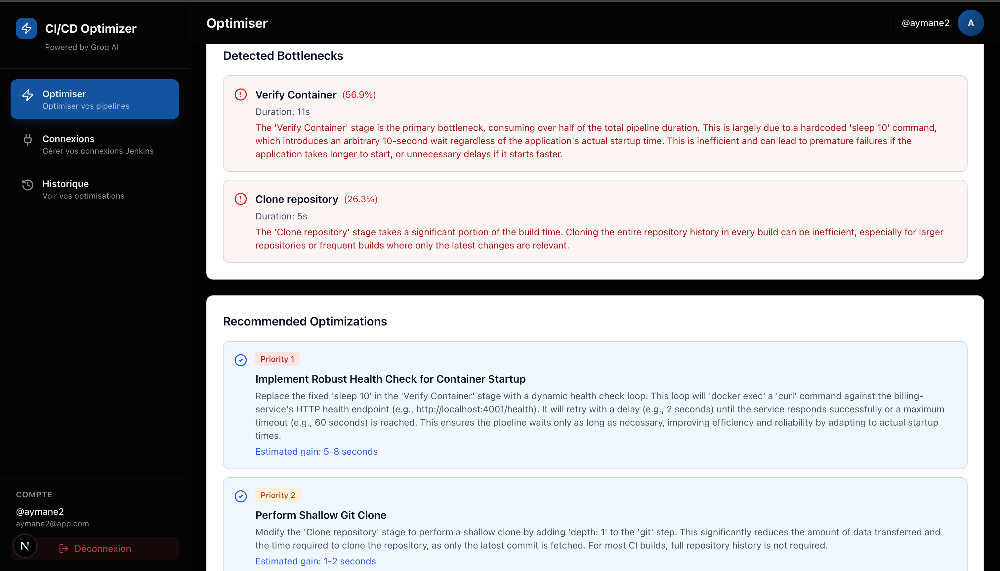
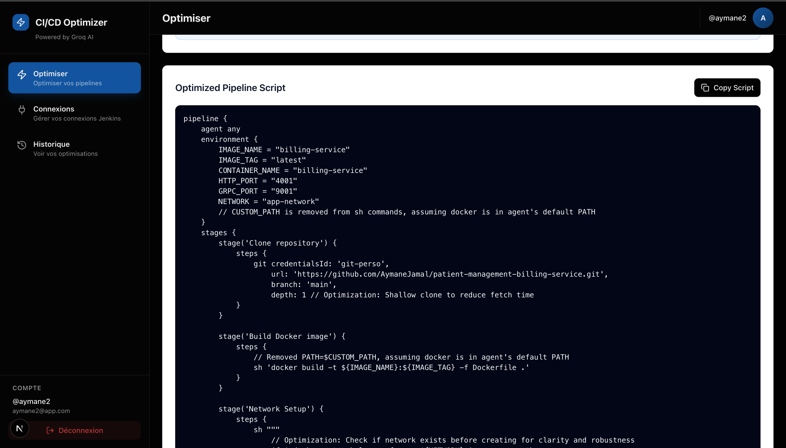
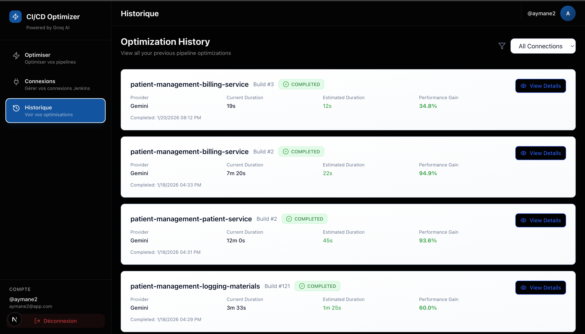

## API et collection Bruno

Les endpoints REST sont regroupés dans une collection Bruno :

- [backend/CI-CD Analyser API/bruno.json](backend/CI-CD%20Analyser%20API/bruno.json)
- [backend/CI-CD Analyser API](backend/CI-CD%20Analyser%20API)

Les routes principales sont centralisées par l’API Gateway (port 8085) avec routage vers Auth Service et Pipeline Orchestrator.

### Authentification

- `POST /api/auth/register`
- `POST /api/auth/login`
- `POST /api/auth/logout`
- `POST /api/auth/validate`

### Connexions Jenkins

- `POST /api/connections`
- `GET /api/connections`
- `GET /api/connections/active`
- `POST /api/connections/{id}/test`
- `POST /api/connections/test-credentials`
- `PUT /api/connections/{id}/toggle`
- `DELETE /api/connections/{id}`

### Données Jenkins

- `GET /api/pipelines?connectionId={id}`
- `GET /api/pipelines/{pipelineName}/builds?connectionId={id}`
- `GET /api/pipelines/{pipelineName}/builds/{buildNumber}/logs?connectionId={id}`
- `GET /api/pipelines/{pipelineName}/config?connectionId={id}`
- `GET /api/pipelines/{pipelineName}/builds/{buildNumber}/statistics?connectionId={id}`
- `GET /api/pipelines/agents?connectionId={id}`
- `GET /api/pipelines/server-info?connectionId={id}`

### Optimisation et historique

- `POST /api/optimization/optimize`
- `GET /api/optimization/history?connectionId={id}`
- `GET /api/optimization/history/me`
- `GET /api/optimization/history/pipeline?connectionId={id}&pipelineName={name}`
- `GET /api/optimization/history/{id}`

## Tests et validation

### Qualité code (SonarQube)

Une configuration SonarQube est fournie pour l’analyse continue des microservices (intégration Maven + JaCoCo). L’outil est optionnel et sert de référence pour la qualité du code, sans détail de résultats dans ce document.

### Tests unitaires et intégration

Le module AI Analyzer est couvert par des tests unitaires et d’intégration :

- OptimizationServiceTest
- PromptBuilderServiceTest
- JsonParserTest
- OptimizationIntegrationTestSimple

Emplacement des tests : [backend/ai-analyzer-service/src/test/java](backend/ai-analyzer-service/src/test/java).

### Validation expérimentale (cas réel)

Pipeline patient-management-logging-materials :

- **Avant** : Build #122 = 5 min 35 s
- **Après** : Build #126 = 51 s
- **Gain** : 284 s (85,1 %)

Principaux bottlenecks identifiés :

- Deploy Stack (79,0 %, 4m24s) : sleep fixe remplacé par health checks
- Send Test Logs (8,2 %, 27s) : boucles sleep évitables
- Clone repository (8,4 %, 28s) : shallow clone ou cache
- Build Logstash Image (3,3 %, 10s) : cache Docker

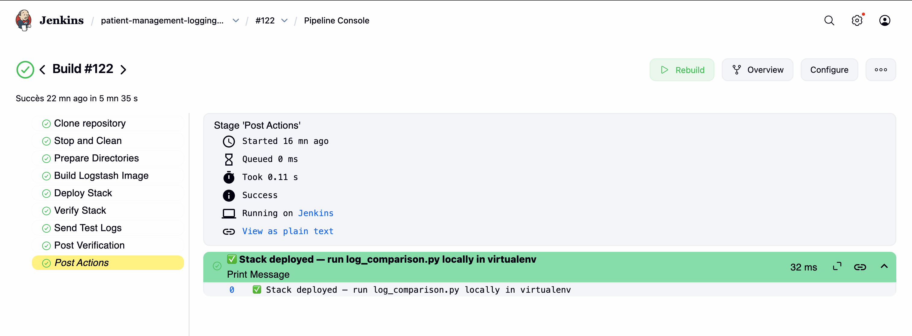
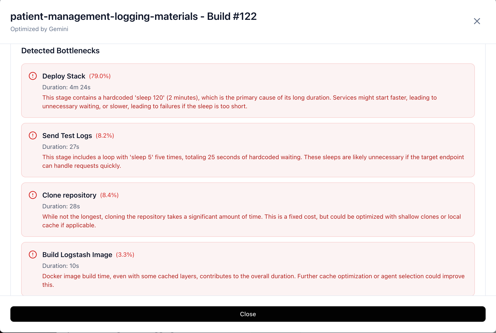
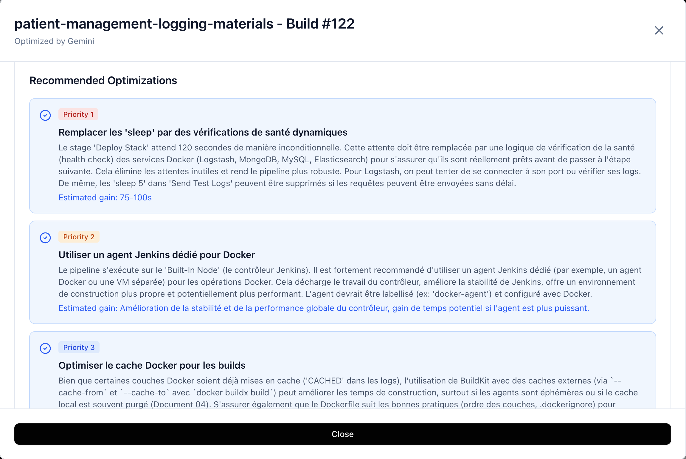
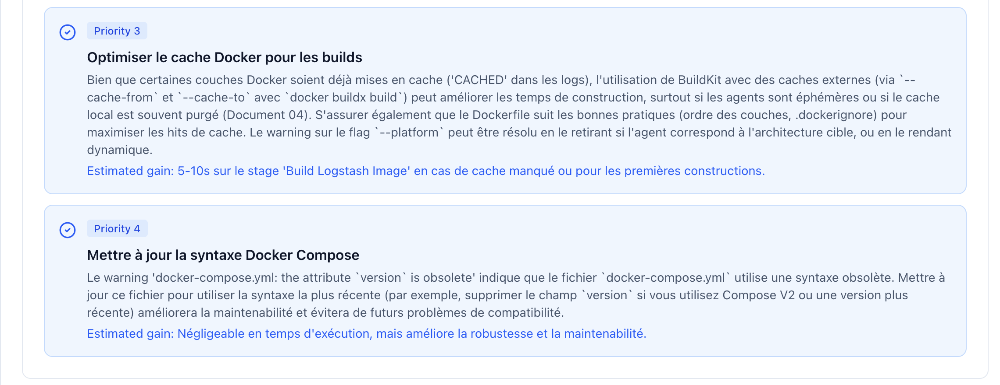
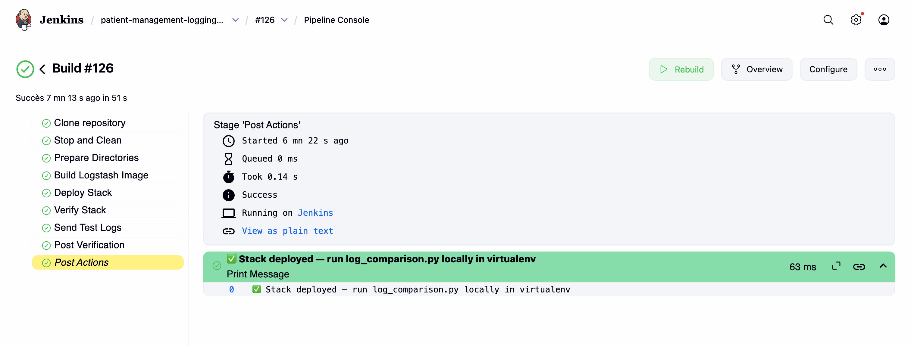

## Démarrage du projet

### 1) Lancer les services Docker requis

Les bases de données et Redis se lancent via Docker Compose dans [backend/Configuration](backend/Configuration).

Commande recommandée (depuis la racine du projet) :

```bash
docker compose -f "backend/Configuration/Auth DB & Auth Redis/docker-compose.yml" up -d
docker compose -f "backend/Configuration/DB config/docker-compose.yml" up -d
```

Fichiers utilisés :

- [backend/Configuration/Auth DB & Auth Redis/docker-compose.yml](backend/Configuration/Auth%20DB%20%26%20Auth%20Redis/docker-compose.yml)
- [backend/Configuration/DB config/docker-compose.yml](backend/Configuration/DB%20config/docker-compose.yml)

### 2) (Optionnel) SonarQube

Une configuration SonarQube est fournie. Son exécution est facultative.

```bash
docker compose -f "backend/Configuration/Sonar Qube/docker-compose.yml" up -d
```

Fichier : [backend/Configuration/Sonar Qube/docker-compose.yml](backend/Configuration/Sonar%20Qube/docker-compose.yml)

### 3) Démarrer les microservices

Depuis chaque dossier de service, lancer :

```bash
./mvnw spring-boot:run
```

Ordre recommandé :

1. auth-service
2. jenkins-connector
3. ai-analyzer-service
4. pipeline-orchestrator
5. api-gateway

Services :

- [backend/auth-service](backend/auth-service)
- [backend/pipeline-orchestrator](backend/pipeline-orchestrator)
- [backend/jenkins-connector](backend/jenkins-connector)
- [backend/ai-analyzer-service](backend/ai-analyzer-service)
- [backend/api-gateway](backend/api-gateway)

### 4) Démarrer le frontend

```bash
cd frontend
npm install
npm run dev
```

Le frontend consomme l’API Gateway sur `http://localhost:8085` (voir [frontend/lib/api-client.ts](frontend/lib/api-client.ts)).

## Configuration

### LLM Provider

Le provider LLM est configurable dans [backend/ai-analyzer-service/src/main/resources/application.properties](backend/ai-analyzer-service/src/main/resources/application.properties) :

- `llm.provider` = `gemini` | `groq` | `openai`
- `gemini.api.key`, `groq.api.key`, `openai.api.key`

Remplacez les clés par vos propres secrets.

### Ports

- API Gateway : 8085
- Auth Service : 5004
- Pipeline Orchestrator : 5003
- Jenkins Connector : 5001
- AI Analyzer : 5002

### Headers requis

Pour les routes protégées, l’API Gateway injecte `X-User-Email`. Le frontend envoie :

- `Authorization: Bearer <accessToken>`
- `X-CSRF-Token: <csrfToken>` pour POST/PUT/DELETE/PATCH

### Bases de données

- Auth DB : PostgreSQL sur 5439
- Business DB : PostgreSQL sur 5438
- Redis : 6379

## Structure du dépôt

- [backend/ai-analyzer-service](backend/ai-analyzer-service)
- [backend/api-gateway](backend/api-gateway)
- [backend/auth-service](backend/auth-service)
- [backend/jenkins-connector](backend/jenkins-connector)
- [backend/pipeline-orchestrator](backend/pipeline-orchestrator)
- [backend/Configuration](backend/Configuration)
- [backend/CI-CD Analyser API](backend/CI-CD%20Analyser%20API)
- [frontend](frontend)

## Conclusion

Ce projet constitue une contribution initiale à la communauté DevOps. Il reste volontairement vierge sur plusieurs aspects d’optimisation avancée et ouvre la voie à des évolutions importantes (qualité des recommandations, automatismes, couverture multi-plateformes, intelligence prédictive). Il peut être largement développé pour devenir une solution mature et robuste.
